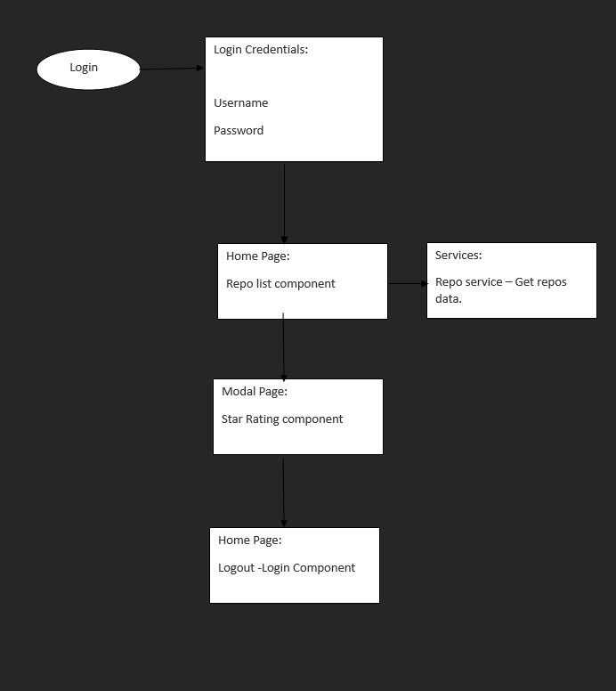

# GITHUB REPO APP

# Idea of the App

The project aims to implement a small web app that lists the most starred GitHub repositories created in the last 30 days. The app fetches sorted JSON data directly from the GitHub API.
## Table of Contents

- [Requirements](https://github.com/prasanth557/github-repo-app#Requirements)
- [Technologies Used](https://github.com/prasanth557/github-repo-app#technologies-used)
- [Features](https://github.com/prasanth557/github-repo-app#features)
- [Project Structure](https://github.com/prasanth557/github-repo-app#project-structure)
- [Architecture](https://github.com/prasanth557/github-repo-app#architecture)
- [Installation](https://github.com/prasanth557/github-repo-app#installation)
- [Development Server](https://github.com/prasanth557/github-repo-app#development-server)

## Requirements

### Technologies Used
- Angular
- Bootstrap
- HTML
- CSS
- Angular Forms
- rxjs

### Features
List Most Starred Repositories:

1. Users can view the most starred GitHub repos created in the last 30 days.
Results Display:

2. Repositories are displayed in a list format, with one repository per row.
Detailed Information:

3. For each repo, users can see:
Repository name
Repository description
Number of stars for the repo
Number of issues for the repo
Username and avatar of the owner.

4. Pagination:

Users can keep scrolling, and new results will appear, enabling pagination.

## Project Structure

The project structure includes the following components:

# Points
-> Modal Window:
-> Users can click on the repo name to open a modal window with detailed information.
-> Rating System:
-> Users can rate the repo using a 5-star model within the modal window.
-> Display Ratings:
-> The given rating is displayed on the right side of the repo name.

## Architecture


## Installation

1. Clone the repository:

   ```bash
   git clone https://github.com/prasanth557/github-repo-app.git

2. Navigate to the project folder:

   cd github-repo-app

3. Install dependencies:
   
   npm install
   npm i @ng-bootstrap/ng-bootstrap
   npm install rxjs
   
4. Start the development server:

   ng serve

# Usage - workflow

1. User credentials - username= 'prash' , password= '1234'
  - it will redirect to home page
2. Here you can see the list of all repositories with images
3. you can navigate through pages or click loadmore button to load more repos.
4. On click name of repo or GiveRating button - a modal popup will appear with data you click on repository.
5. you can give rating out of 5
6. now you can submit and close the modal.
7. Logout application- redirect to login page.

This project was generated with [Angular CLI](https://github.com/angular/angular-cli) version 16.2.4.

## Development server

Run `ng serve` for a dev server. Navigate to `http://localhost:4200/`. The application will automatically reload if you change any of the source files.

## Code scaffolding

Run `ng generate component component-name` to generate a new component. You can also use `ng generate directive|pipe|service|class|guard|interface|enum|module`.

## Build

Run `ng build` to build the project. The build artifacts will be stored in the `dist/` directory.

## Further help

To get more help on the Angular CLI use `ng help` or go check out the [Angular CLI Overview and Command Reference](https://angular.io/cli) page.

# Screenshots of application
#
